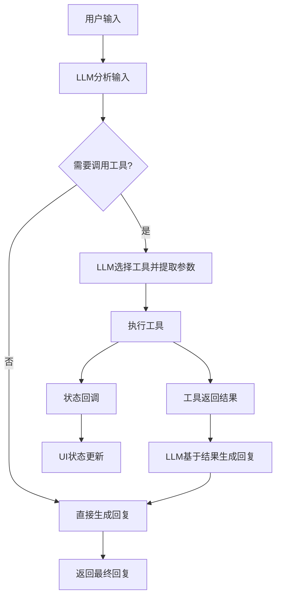

# LLM工具调用机制深度分析

## 概述

本文档详细分析了Translator Agent项目中LLM工具调用的完整流程和控制机制，解释了LLM如何知道该调用工具、如何获取结果以及整个过程的控制流程。

## LLM工具调用的完整流程

### 1. 工具注册阶段：告诉LLM有哪些工具可用

```typescript
const result = await generateText({
  model: getLanguageModel(modelName),
  system: `You are a helpful translation assistant. You can help translate text, files, and web pages.

Available tools:
- file_reader: Read local text files (.md, .txt, .html, etc.) when user provides a file path
- url_fetcher: Fetch and convert web pages to markdown when user provides a URL

When the user provides a file path or URL, use the appropriate tool to fetch the content first, then provide translation or other assistance.`,
  temperature: 0.1,
  maxSteps: 5,
  messages: messages,
  tools: {
    file_reader: tool({
      description: 'Read local text files (.md, .txt, .html, etc.) and return structured content',
      parameters: z.object({
        filePath: z.string().describe('The local file path to read')
      }),
      execute: async ({ filePath }) => {
        // 工具执行逻辑
      }
    })
  }
});
```

**关键机制**：
- **System Prompt**：明确告诉LLM什么时候应该使用工具
- **工具描述**：每个工具都有详细的description，LLM根据这个判断是否调用
- **参数Schema**：使用Zod定义参数结构，LLM知道需要提供什么参数

### 2. LLM决策阶段：如何知道该调用工具

LLM通过以下信息决定是否调用工具：

1. **System Prompt指导**：
   - "当用户提供文件路径时，使用file_reader工具"
   - "当用户提供URL时，使用url_fetcher工具"

2. **工具描述匹配**：
   - LLM分析用户输入，匹配工具描述
   - 例如用户说"翻译这个文件：/path/to/file.txt"，LLM识别到文件路径，决定调用file_reader

3. **参数提取**：
   - LLM从用户输入中提取所需参数
   - 根据Zod schema验证参数格式

### 3. 工具执行阶段：异步执行控制

```typescript
execute: async ({ filePath }) => {
  callbacks?.onToolCall?.('file_reader', { filePath });
  callbacks?.onStatusChange?.(`Reading file: ${filePath}`);
  
  const abortController = new AbortController();
  const context = {
    abortController,
    options: { isNonInteractiveSession: false }
  };
  
  for await (const result of fileReaderTool.call({ filePath }, context)) {
    if (result.type === 'file_read') {
      callbacks?.onToolResult?.('file_reader', result.data);
      return result.data;  // 这里返回给LLM
    } else if (result.type === 'error') {
      throw new Error(result.data.message);
    }
  }
}
```

**执行控制机制**：

1. **状态回调**：
   - `onToolCall`：工具开始执行时触发
   - `onStatusChange`：执行过程中的状态更新
   - `onToolResult`：工具执行完成时触发

2. **AsyncGenerator模式**：
   ```typescript
   async* call(
     input: FileReaderInput,
     context: { abortController: AbortController; options: { isNonInteractiveSession: boolean } }
   ): AsyncGenerator<ToolResult, void, unknown> {
     try {
       const content = await readFile(filePath, 'utf-8');
       const result: FileReaderResult = {
         filename,
         content
       };

       yield {
         type: 'file_read',
         data: result
       };
     } catch (error) {
       yield {
         type: 'error',
         data: { message: error.message }
       };
     }
   }
   ```

3. **中断控制**：
   - 使用`AbortController`支持工具执行的中途取消
   - 支持超时和用户主动取消

### 4. 结果返回阶段：工具如何把结果发回给LLM

**关键机制是`return`语句**：

```typescript
for await (const result of fileReaderTool.call({ filePath }, context)) {
  if (result.type === 'file_read') {
    callbacks?.onToolResult?.('file_reader', result.data);
    return result.data;  // 🔑 这里直接返回给AI SDK
  } else if (result.type === 'error') {
    throw new Error(result.data.message);
  }
}
```

**数据流向**：
1. 工具执行 → `yield result`
2. AI客户端接收 → `return result.data`
3. AI SDK接收返回值 → 自动传递给LLM
4. LLM基于工具结果生成最终回复

### 5. 多步骤对话控制：maxSteps机制

```typescript
const result = await generateText({
  model: getLanguageModel(modelName),
  maxSteps: 5,  // 🔑 允许最多5步交互
  // ...
});
```

**步骤流程**：
1. **Step 1**：LLM分析用户输入，决定调用工具
2. **Step 2**：工具执行，返回结果给LLM
3. **Step 3**：LLM基于工具结果生成最终回复
4. **可能的Step 4-5**：如果需要调用多个工具或进一步处理

## 状态控制和用户反馈

### 实时状态更新机制

```typescript
const callbacks: ToolCallbacks = {
  onToolCall: (toolName: string, args: any) => {
    setToolStatus(`Calling ${toolName} tool...`);
  },
  onToolResult: (toolName: string, result: any) => {
    const toolMessage: Message = {
      id: `tool-${Date.now()}`,
      text: JSON.stringify(result, null, 2),
      timestamp: new Date(),
      role: 'tool',
      toolName,
    };
    setMessages(prev => [...prev, toolMessage]);
    setToolStatus('');
  },
  onStatusChange: (status: string) => {
    setToolStatus(status);
  },
};
```

## 关键设计亮点

### 1. 双层抽象设计
- **AI SDK层**：处理LLM通信和工具调用协议
- **应用层**：处理UI状态和用户反馈

### 2. 事件驱动架构
- 工具执行过程通过回调函数实时反馈状态
- UI层通过事件监听更新界面状态

### 3. 错误处理机制
- 工具执行错误会抛出异常，AI SDK自动处理
- 支持优雅降级，即使工具失败LLM也能给出回复

### 4. 流式处理支持
- AsyncGenerator模式支持大文件的流式处理
- 可以在处理过程中提供进度反馈

## 核心控制流程



## 总结

这个设计的精妙之处在于：
1. **LLM自主决策**：通过system prompt和工具描述让LLM自己判断何时调用工具
2. **透明的数据流**：工具结果直接返回给LLM，无需复杂的状态管理
3. **实时反馈**：通过回调机制提供用户友好的状态更新
4. **错误恢复**：即使工具失败，LLM仍能基于已有信息给出回复

这种设计让非专业程序员也能轻松理解和扩展工具系统，同时保持了高度的灵活性和可靠性。
